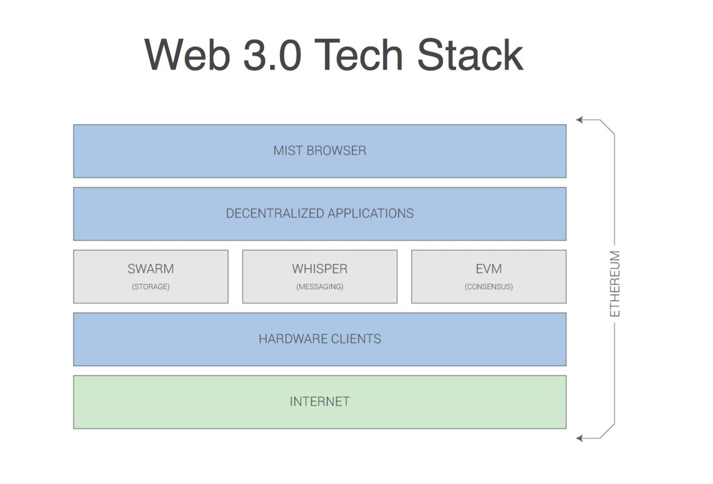

# Ethereum

- 作者：冯沁原
- 网站：[www.BitTiger.io](https://www.BitTiger.io)
- 原文：[https://github.com/Fabsqrt/Blockchain](https://github.com/Fabsqrt/Blockchain)
- 邮箱：Qinyuan@BitTiger.io
- 微信：zhaxisangbo

## 基本简介

Ethereum是一个图灵机，通过编写协议来驱动状态的改变。

什么是图灵机？状态和状态转移。

核心功能？所有权、交易、状态转换。

账号是什么？一个160位的二进制。

都是人能够控制的吗？人能够直接控制的是外部账号；通过代码控制的是内部账号。

如何防止有人超长时间占用节点？需要付费。

所谓以太坊，我们可以把它理解为一台很大的服务器。这个服务器有以下特征
- 保存代码的地方：智能合约所保存的地方
- 执行计算的顺序：所有的程序都是按照顺序执行
- 每个计算的操作者：sender

## 系统架构

（来源: [Matemaz Twitter](https://twitter.com/matemaz/status/789435789616746497)）

### Go-ethereum

Ethereum最流行的Go版本的实现。

### Solidity

Solidity只是实现智能合约的一种语言。它会被编译为编译成供EVM执行的ByteCode的高级语言，之后可以上传到以太坊。

### Mist

Ethereum的应用查看器。

## 总结：Ethereum

我们这里只是对Ethereum的架构进行了基本介绍，让我们在下一节课中继续深入探讨。
