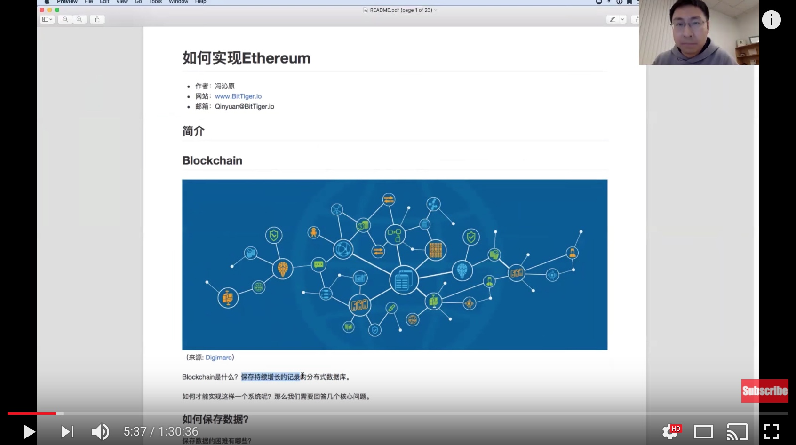
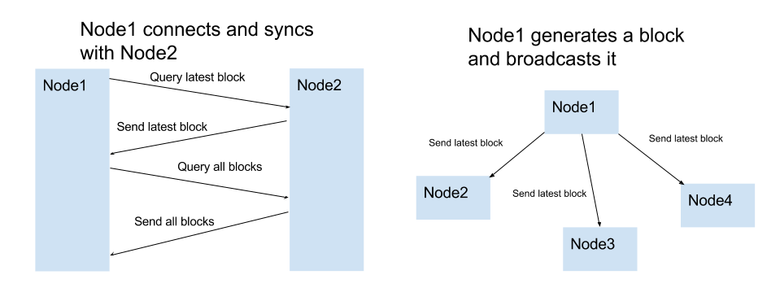
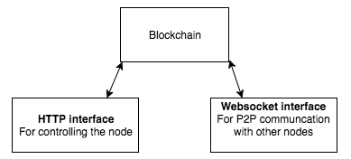
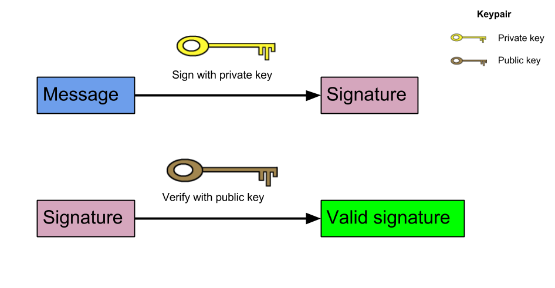
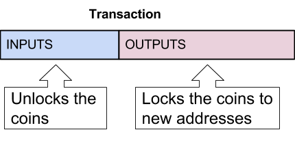
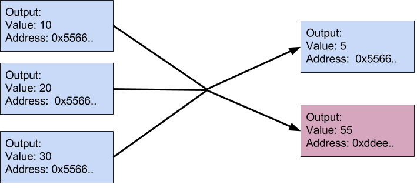
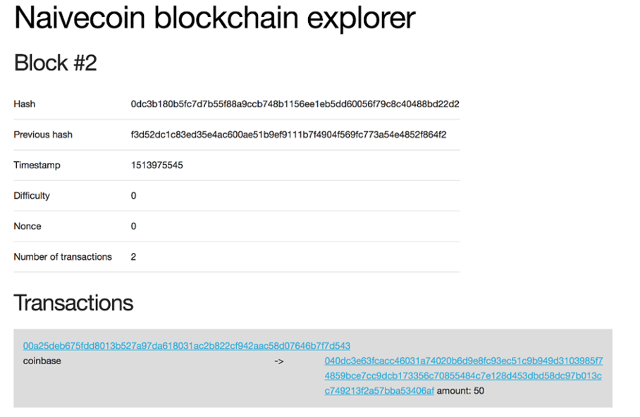
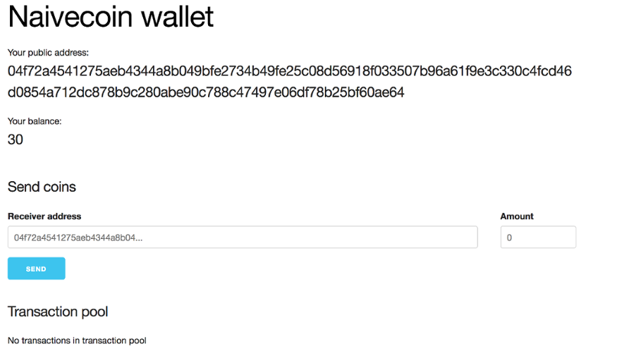

# 如何实现Blockchain、Bitcoin、Ethereum

- 作者：冯沁原
- 网站：[www.BitTiger.io](https://www.BitTiger.io)
- 原文：[github.com/Fabsqrt/BitTigerLab](https://github.com/Fabsqrt/BitTigerLab)
- 邮箱：Qinyuan@BitTiger.io

## 观看课程视频

[](https://www.youtube.com/watch?v=_V7MntH_Tu8 "沁原教学：带你一小时搭建自己的区块链（Blockchain、Bitcoin、Ethereum）")

## Blockchain


（来源: [Digimarc](https://www.digimarc.com/public_images/blockchain-1500x600.jpg)）

Blockchain是什么？保存持续增长的记录的分布式数据库。

如何才能实现这样一个系统呢？那么我们需要回答几个核心问题。

### 如何保存数据？

保存数据的困难有哪些？

- 数据逐渐增加，如何应对？
- 如何对之前的数据进行修改？

解决方案

- 如同记录log，不断的记录新的数据，然后将这些数据连接起来
- 也就是LinkedList

```java

Class DataBlock {
    getData();
    setData();
    getPre();
    getNext();
}

```

数据能否被修改呢？因为如果支持修改，可能引发很多的同步问题。那么能否不支持修改呢？实际上，GFS的整体架构就是构建在不可修改的数据结构之上。

于是，我们推论出构建不可修改的串联的数据块。但是我们要注意的是虽然底层数据不能修改，但是上层的数据视图是可以修改的。

如何让很多人都对数据有信心，相信是真实的，不能被篡改呢？每个人都保存一份同样的数据。

### 如何添加数据呢

我们添加的每一份数据都需要按照同样的方式添加到每个人保存的副本中。

我们能否具有计算能力呢？为什么需要计算能力？我们从此可以得到一个通用的计算机，也把数据的修改模型更加地简化和通用化。

我们如何定义计算能力呢？要回答这个问题，我们首先要想的是这个分布式的计算机的各个部分是如何构成的。

谁来构成整个存储空间？每一个具体的地址。每一个地址保存了什么？数据。如何才能对地址计算呢？我们可以把对数据的处理逻辑也放入这个地址。那么一个地址到底需要什么呢？地址信息、财富信息、数据信息、代码。

于是，所谓的状态就是指系统中每一个地址和地址对应的状态的集合。我们通过一个一个的交易来进入新的状态。

接着， 我们可以把状态转移的过程也记录下来，这个就是记录transaction的block。这些block连接在一起，形成blockchain。

### 如何应对同时写入的混乱

如何防止很多人一起写造成的混乱呢？大家同时解决一个难题，谁先解出来，谁就能够写入。

如何防止有人同时解出来？这个有可能，但是连续多次都是同时有人解出来的概率较低，于是选择链最长的那一个。

## Nativecoin实战

我们在上一节介绍了BlockChain的基本原理，让我们在这里通过实际的代码进一步实战，实现一个支持Token的BlockChain。

### 如何保存数据

区块链的基本概念是：保存持续增长的有序数据的分布式数据库。那么，我们需要满足以下功能：

- 定义数据块
- 定义数据块之间的关系
- 添加数据块的功能
- 节点之间的通讯
- 节点之间同步数据
- 对节点的控制能力

#### 区块的结构是什么

因为区块链中的数据是相互连接的数据块，因此我们需要创建LinkedList来实现这样的场景。


（来源: [NativeCoin](https://lhartikk.github.io/jekyll/update/2017/07/14/chapter1.html)）

如上图所示，我们可以看到以下核心元素：

- index：区块的递增编号
- data：该区块所保存的数据
- timestamp：时间戳
- hash：通过SHA256算法对该区块进行的签名
- previousHash：前一个数据块的hash值，从而将区块串联了起来

于是我们可以得到对应的代码：

```TypeScript
class Block {

    public index: number;
    public hash: string;
    public previousHash: string;
    public timestamp: number;
    public data: string;

    constructor(index: number, hash: string, previousHash: string, timestamp: number, data: string) {
        this.index = index;
        this.previousHash = previousHash;
        this.timestamp = timestamp;
        this.data = data;
        this.hash = hash;
    }
}
```

#### 如何保证数据不被篡改

在计算机的世界中，一切都是用数学来解释，用数学来证明。对于一个数据块，我们计算出它的摘要。只要保证数据有变化，必然会引发摘要变化即可。在这里我们使用的是SHA256的Hash算法。从这个角度来说，Hash也可以被看成这块数据的DNA。

具体的Hash的过程如下，

```TypeScript
const calculateHash = (index: number, previousHash: string, timestamp: number, data: string): string =>
    CryptoJS.SHA256(index + previousHash + timestamp + data).toString();
```

聪明的读者可能会发现，这个简单的方法并不能防范更加复杂的黑客攻击。因此，我们会不断的改进我们的代码，以抵挡这个世界的某些恶意。

但是现在的我们至少能够通过Hash来唯一的验证一个区块链的结构了。为什么？因为我们在做Hash的时候，也把这个区块对应的上一个区块的Hash放了进来，因此如果有人想要篡改整个区块链上的任何一个区块，都会产生蝴蝶效应，后续的区块都会为止失效。


（来源: [NativeCoin](https://lhartikk.github.io/jekyll/update/2017/07/14/chapter1.html)）

如上图所示，如果我们把区块44的数据从TREE改为STREET，那么它自身的Hash结果会改变，接着区块45中的previousHash也会发生改变，于是区块45的Hash也会改变，以此类推。因此，越早的区块发生异常，那么带来的影响就会越大。

#### 如何创建第一个区块

第一个数据块的难点在哪里？它没有previousHash！因此，我们直接硬编码即可。

```TypeScript
const genesisBlock: Block = new Block(
    0, '816534932c2b7154836da6afc367695e6337db8a921823784c14378abed4f7d7', null, 1465154705, 'my genesis block!!'
);
```

#### 如何创建新的区块

创建区块如同炒菜，需要备好所有的原料。如同以下的代码所示，我们需要找到最后一个有效的区块，推理出下一个区块的index，得到当前的时间戳，再结合上一个区块的hash和当前的数据，也就能知道当前区块的hash，从而创建出新的区块。

```TypeScript
const generateNextBlock = (blockData: string) => {
    const previousBlock: Block = getLatestBlock();
    const nextIndex: number = previousBlock.index + 1;
    const nextTimestamp: number = new Date().getTime() / 1000;
    const nextHash: string = calculateHash(nextIndex, previousBlock.hash, nextTimestamp, blockData);
    const newBlock: Block = new Block(nextIndex, nextHash, previousBlock.hash, nextTimestamp, blockData);
    return newBlock;
};
```

#### 区块保存在哪里

在当前的版本中，我们只是保存在JavaScript所使用的内存中，因此很容易丢失，但是我们可以逐渐完善，让数据的保存越来越持久。

```TypeScript
const blockchain: Block[] = [genesisBlock];
```

#### 如何验证数据的有效性

在任何一个时刻，如果其他人给了我们一个新的区块，我们如何验证这个区块是正确的呢？这需要符合以下的基本要求：

- 区块之间的索引是+1递增的
- 当前区块的previousHash需要和之前区块的Hash相同
- 区块自身的Hash需要正确

于是，我们实现的代码如下：

```TypeScript
const isValidNewBlock = (newBlock: Block, previousBlock: Block) => {
    if (previousBlock.index + 1 !== newBlock.index) {
        console.log('invalid index');
        return false;
    } else if (previousBlock.hash !== newBlock.previousHash) {
        console.log('invalid previoushash');
        return false;
    } else if (calculateHashForBlock(newBlock) !== newBlock.hash) {
        console.log(typeof (newBlock.hash) + ' ' + typeof calculateHashForBlock(newBlock));
        console.log('invalid hash: ' + calculateHashForBlock(newBlock) + ' ' + newBlock.hash);
        return false;
    }
    return true;
};
```

这里还有一个细节，如果区块内数据的结构不正确，也可能是一个问题。因此我们还要额外进行判断。

```TypeScript
const isValidBlockStructure = (block: Block): boolean => {
    return typeof block.index === 'number'
        && typeof block.hash === 'string'
        && typeof block.previousHash === 'string'
        && typeof block.timestamp === 'number'
        && typeof block.data === 'string';
};
```

我们现在可以完整的验证一条区块链了吗？可以。我们首先要单独处理第一个区块，然后依次验证之后的每一个区块。

```TypeScript
const isValidChain = (blockchainToValidate: Block[]): boolean => {
    const isValidGenesis = (block: Block): boolean => {
        return JSON.stringify(block) === JSON.stringify(genesisBlock);
    };

    if (!isValidGenesis(blockchainToValidate[0])) {
        return false;
    }

    for (let i = 1; i < blockchainToValidate.length; i++) {
        if (!isValidNewBlock(blockchainToValidate[i], blockchainToValidate[i - 1])) {
            return false;
        }
    }
    return true;
};
```

#### 区块链分叉了怎么办

在一个分布式的环境中，有可能不同的人在同一个区块后添加了新的不同的区块，那我们要听谁的呢？听大多数人的话（尽管现实中大多数人的话也许……）！那谁才能代表大多数的人民呢？实力更强大，更长的那一条链。因此在遇到多条链的时候，我们可以直接选择更长的一条。具体代码如下，

```TypeScript
const replaceChain = (newBlocks: Block[]) => {
    if (isValidChain(newBlocks) && newBlocks.length > getBlockchain().length) {
        console.log('Received blockchain is valid. Replacing current blockchain with received blockchain');
        blockchain = newBlocks;
        broadcastLatest();
    } else {
        console.log('Received blockchain invalid');
    }
};
```

#### 节点之间要如何通讯

因为在整个网络中有很多节点，大家都有可能去创建区块，这就需要大家通过协商通讯的方式达成共识，这需要以下三个基本能力：

- 当个节点创建了一个区块，需要通知整个网络
- 当一个节点连接上了一个新的节点，需要主动询问对方最新的区块
- 当一个节点遇到一个新的区块，它会根据判断的结果向网络请求更多的区块


（来源: [NativeCoin](https://lhartikk.github.io/jekyll/update/2017/07/14/chapter1.html)）

上图给出了节点通讯的具体流程。需要注意的是，在我们的代码中，所有的连接都被爆存在了 ```WebSocket[]```。我们并没有实现节点发现的功能，因此节点的位置需要手动的添加。

#### 如何控制节点

我们需要一个对外的接口来控制一个节点，从而能够查看节点的区块、添加区块、查看连通的节点、添加节点。于是我们通过以下代码实现了HTTP对外的服务接口。

```TypeScript
const initHttpServer = ( myHttpPort: number ) => {
    const app = express();
    app.use(bodyParser.json());

    app.get('/blocks', (req, res) => {
        res.send(getBlockchain());
    });
    app.post('/mineBlock', (req, res) => {
        const newBlock: Block = generateNextBlock(req.body.data);
        res.send(newBlock);
    });
    app.get('/peers', (req, res) => {
        res.send(getSockets().map(( s: any ) => s._socket.remoteAddress + ':' + s._socket.remotePort));
    });
    app.post('/addPeer', (req, res) => {
        connectToPeers(req.body.peer);
        res.send();
    });

    app.listen(myHttpPort, () => {
        console.log('Listening http on port: ' + myHttpPort);
    });
};
```

于是，我们可以直接访问接口进行控制。例如，获得全部区块的列表。

```Curl
#get all blocks from the node
> curl http://localhost:3001/blocks
```

#### 系统的架构是什么


（来源: [NativeCoin](https://lhartikk.github.io/jekyll/update/2017/07/14/chapter1.html)）

如上图所示，我们每个节点都会向外提供两个服务：

- 让外部用户能够控制这个节点的HTTP server服务
- 支持节点之间通讯的Websocket HTTP server服务

#### 小结：如何保存数据

综上所述，我们已经构建了能够保存区块的区块链的服务结构，实现了创建区块和控制节点的基本能力。让我们继续添加更多的功能吧。

### 如何应对攻击

在我们已经实现的版本中，每个人都能在其中添加区块，这样不仅可能造成混乱，而且如果有人拼命的添加区块也会阻塞整个网络。

如何应对呢？那我们就限制每个人添加区块的能力吧。如何限制呢？记得你在网站每次注册新账号的时候都会出现的验证码吗？我们只要让大家在每次添加区块的时候都要做一道“难题”即可。这就是Proof-of-Work的基本原理，而这个解题过程就被称之为挖矿。

因此，这个难题的设置会影响到节点添加区块的难度。越难的题会让我们越难添加区块，相对来说安全性会上升，但是延迟很可能增加。

#### 如何设置不同难度的题目

一个好的题目要让计算机便于理解，运算规则相对简单，运算方式相对公平。于是结合Hash算法的题目被设计了出来：找到一个特定区块，这个区块的Hash需要有特殊的前缀。

这个前缀越特殊，难度就越大。于是我们可以定义出题目的难度difficulty为你所定义的特殊的前缀是由几个0组成。例如，如果你只要求找到的区块的Hash有一个0（difficulty=0），那么可能相对简单；但是如果你要求你找到的区块的Hash的前缀有10个0（difficulty=10），那么就有点难了。下图给出了更细节的展示。


（来源: [NativeCoin](https://lhartikk.github.io/jekyll/update/2017/07/13/chapter2.html)）

我们可以相应的实现检查Hash是否满足difficulty的代码。

```TypeScript
const hashMatchesDifficulty = (hash: string, difficulty: number): boolean => {
    const hashInBinary: string = hexToBinary(hash);
    const requiredPrefix: string = '0'.repeat(difficulty);
    return hashInBinary.startsWith(requiredPrefix);
};
```

为了找到满足difficulty条件的Hash，我们需要对同一个区块计算出不同的Hash。但是这个Hash算法的一致性相矛盾。可是我们可以通过在区块中加入新的参数来实现Hash结果的变化，因为SHA256会因为数据的任何微小变化为完全变化。于是我们添加了一个叫做Nonce的参数，并且不断的改变这个参数直到挖到我们想要的Hash结果。于是一个区块的数据结构更新如下：

```TypeScript
class Block {

    public index: number;
    public hash: string;
    public previousHash: string;
    public timestamp: number;
    public data: string;
    public difficulty: number;
    public nonce: number;

    constructor(index: number, hash: string, previousHash: string,
                timestamp: number, data: string, difficulty: number, nonce: number) {
        this.index = index;
        this.previousHash = previousHash;
        this.timestamp = timestamp;
        this.data = data;
        this.hash = hash;
        this.difficulty = difficulty;
        this.nonce = nonce;
    }
}
```

#### 如何解一个难题

基于以上的分析，我们不断的增加Nonce的值，直到找到一个有效的Hash，具体代码如下：

```TypeScript
const findBlock = (index: number, previousHash: string, timestamp: number, data: string, difficulty: number): Block => {
    let nonce = 0;
    while (true) {
        const hash: string = calculateHash(index, previousHash, timestamp, data, difficulty, nonce);
        if (hashMatchesDifficulty(hash, difficulty)) {
            return new Block(index, hash, previousHash, timestamp, data, difficulty, nonce);
        }
        nonce++;
    }
};
```

当我们找到了一个有效的Hash，就把这个区块广播给整个网络。

#### 如何确定难度

虽然我们能够指定问题的难度，但是我们要如何设置难度呢？而且如何才能让网络的节点都认同这个难度呢？

让我们回归到区块链的本身。区块链无非是一个区块的链表，并且每隔一段时间会加入一个新的区块。而我们的题目就是在控制加入区块的难度，也就是加入的时间间隔，于是我们引入一个全局参数：

- ```BLOCK_GENERATION_INTERVAL```：定义了多久产生一个区块（Bitcoin是10分钟，Ethereum大概10-20秒）

但是随着环境的变化，例如有更多的节点加入网络，我们并不能一致维持这个时间，因此我们每隔一段时间需要调整一下难度，于是我们引入第二个全局参数：

- ```DIFFICULTY_ADJUSTMENT_INTERVAL```：定义了每隔多久调整一次难度（Bitcoin是2016个区块，Ethereum是更加动态的调整)

在我们的代码中，我们会设置间隔为10秒。

```TypeScript
// in seconds
const BLOCK_GENERATION_INTERVAL: number = 10;

// in blocks
const DIFFICULTY_ADJUSTMENT_INTERVAL: number = 10;
```

于是在我们的区块链中每产生10个区块就会查看区块的生成频率是否满足我们的预期

 ```BLOCK_GENERATION_INTERVAL * DIFFICULTY_ADJUSTMENT_INTERVAL```。我们会根据预期和现实之间的差异决定如何调整难度。具体来说，我们判断差异是否到了2倍的范围，我们会对difficulty进行```+1```或者```-1```的操作。具体代码如下：

```TypeScript

const getDifficulty = (aBlockchain: Block[]): number => {
    const latestBlock: Block = aBlockchain[blockchain.length - 1];
    if (latestBlock.index % DIFFICULTY_ADJUSTMENT_INTERVAL === 0 && latestBlock.index !== 0) {
        return getAdjustedDifficulty(latestBlock, aBlockchain);
    } else {
        return latestBlock.difficulty;
    }
};

const getAdjustedDifficulty = (latestBlock: Block, aBlockchain: Block[]) => {
    const prevAdjustmentBlock: Block = aBlockchain[blockchain.length - DIFFICULTY_ADJUSTMENT_INTERVAL];
    const timeExpected: number = BLOCK_GENERATION_INTERVAL * DIFFICULTY_ADJUSTMENT_INTERVAL;
    const timeTaken: number = latestBlock.timestamp - prevAdjustmentBlock.timestamp;
    if (timeTaken < timeExpected / 2) {
        return prevAdjustmentBlock.difficulty + 1;
    } else if (timeTaken > timeExpected * 2) {
        return prevAdjustmentBlock.difficulty - 1;
    } else {
        return prevAdjustmentBlock.difficulty;
    }
};

```

#### 时间戳被篡改了怎么办

我们题目的难度的调整需要用到区块中保存的时间戳，但是这个时间戳可以由一个节点写入任何值，我们如何应对这样的攻击呢？这里的难点还在于不同节点上的时间本来就会有一定的差异。但是我们知道如果区块的时间戳和我们自己的时间相差越远则越可能有问题，因此我们把这个差异限制上一个区块的创建时间到当前时间范围的1分钟以内。

```TypeScript

const isValidTimestamp = (newBlock: Block, previousBlock: Block): boolean => {
    return ( previousBlock.timestamp - 60 < newBlock.timestamp )
        && newBlock.timestamp - 60 < getCurrentTimestamp();
};

```


#### 有人通过低难度产生超长链怎么办？

我们在上一节讨论过当遇到分叉的时候，选择更长的一个。但是一个恶意节点可以产生一个很长的但是每个区块的难度都是最简单的分叉。这样怎么办？那就把选择标准从最长调整为最难的。也就是说，我们会选择累计解题难度最大的分叉，因为这背后所代表的人民的力量更加强大。

如何计算累计的难度呢？因为每加一个0，我们的计算难度的期望会乘以2，所以我们计算每个区块的```2^difficulty```来求得累计的难度，以此做为选择标准。


（来源: [NativeCoin](https://lhartikk.github.io/jekyll/update/2017/07/13/chapter2.html)）

如上图所示，再A和B两个链条中，虽然B更短，但是因为B的难度更大，所以我们会选择B。

有一个需要注意的是，这里的关键是难度，而并非Hash的前置的0，因为我们有可能碰巧得到一个更多的0的情况。这个思路被称之为“中本聪共识”，是中本聪发明Bitcoin时的一个重要贡献。因为每个节点只有相对较小的Hash计算能力，因此他们会倾向于选择累计难度更长的链条来贡献自己的力量，从而让自己的贡献得到认可。

#### 小结：如何应对攻击

Proof-of-work的特点在于难于计算，易于验证。因此寻找特定前缀的SHA256成为一个很好的难题。

我们已经在代码中加入了难度，并且节点可以通过挖矿来把区块添加到区块链中。

### 如何交易

我们在前两节实现的区块链只是对数据的基本保存，如何能够在这个基础上构建金融体系？但是一个金融体系的基本需求是什么呢？

- 所有权：一个人能够安全的拥有token
- 交易权：一个人能够把自己的token和他人交易

但是我们的区块链是一个没有“信任”的分布式的网络，如何才能构建出“确定性”呢？这需要我们找到一个不可抵赖的证明体系。

#### 如何证明你是你

其实证明自己往往是最难的，这需要我们落地到一个我们可以相信的事情。想一想古代碎玉为半，之后团圆相认的场景。在计算机的世界也是一样，我们把一块美玉的一半告诉全世界，然后把另一半藏在自己身上，这样之后你自己能够拼接处这块美玉。

但这背后的难点在于，别人有了你公布出来的一半的玉，是可以伪造另一半的。但是在计算机的世界里，公钥加密体系却没有这个缺陷。

你有两个钥匙：公钥和私钥。公钥是由私钥推演出来的，并且会公布给所有人。对于你自己发出去的信息，你都可以用你的私钥签名。其他人会收到你的信息和你的签名，然后他会用你的公钥来验证这个信息是否是通过你的私钥进行的签名。具体流程如下图所示。



（来源: [NativeCoin](https://lhartikk.github.io/jekyll/update/2017/07/12/chapter3.html)）

具体来说，我们会选择椭圆曲线加密算法（ECDSA）。到目前为止，我们引入了密码学中的两个核心工具：

- SHA256来支撑区块数据一致性验证
- ECDSA来支撑用户账号的验证

#### 公钥和私钥长什么样

一个有效的私钥是一个32字节的字符串，示例如下：

```
19f128debc1b9122da0635954488b208b829879cf13b3d6cac5d1260c0fd967c
```

一个有效的公钥是由‘04’开头，紧接着64个字节的自负换，示例如下：

```
04bfcab8722991ae774db48f934ca79cfb7dd991229153b9f732ba5334aafcd8e7266e47076996b55a14bf9913ee3145ce0cfc1372ada8ada74bd287450313534a
```

公钥是由私钥演绎得到的，我们可以直接把它做为区块链中一个用户的账号地址。

#### 如何记录一次交易

我们已经能够让用户证明自己是谁了，现在就要记录他们之间的交易了。我们需要三个信息

- 从哪里来：发送者地址
- 到哪里去：接收者地址
- 交易多少：数量

即便如此，我们依然有个疑问？发送者如何证明自己有这个token呢？那么他就需要提供之前他获得这个token的证据。于是我们还需要第四个信息：指向自己的证据的指针。一个例子如下图所示。


（来源: [NativeCoin](https://lhartikk.github.io/jekyll/update/2017/07/12/chapter3.html)）

于是我们需要两个结构分别表示交易的发起者和交易的接收者。

#### 接收者长什么样

对于接受者，我们需要知道他的地址和交易的数量。如上一节所述，地址是ECDSA 的公钥。这意味着，我们还需要保证只有对应私钥的拥有者才能进一步操作这些token。这个结构体的代码如下：

```TypeScript

class TxOut {
    public address: string;
    public amount: number;

    constructor(address: string, amount: number) {
        this.address = address;
        this.amount = amount;
    }
}

```

#### 发起者长什么样

交易的发起者需要提供自己token来源的证据，也就是指向之前的交易。但是他要证明自己对这个交易的拥有权，因此需要提供通过自己私钥加密的签名。这个结构体的代码如下：

```TypeScript

class TxIn {
    public txOutId: string;
    public txOutIndex: number;
    public signature: string;
}

```

需要注意的是这里保存的只是通过私钥进行的签名，而不是私钥本身。在区块链的整个系统中，仅仅存在他的公钥和签名，而不会出现他的私钥。


（来源: [NativeCoin](https://lhartikk.github.io/jekyll/update/2017/07/12/chapter3.html)）

如上图所示，整个过程就是发起者解锁了txIns中的tokens，然后把它们转给了TxOut中的接收者。

#### 完整的交易长什么样

结合之前的讨论，我们可以构建出最终的交易：

```TypeScript

class Transaction {
    public id: string;
    public txIns: TxIn[];
    public txOuts: TxOut[];
}

```

#### 如何唯一表示一次交易

我们依然可以使用SHA256来进行Hash，并且使用这个Hash来做为交易的id。这里要注意的是我们并没有包含发起者的签名，这个会在之后添加。

```TypeScript

const getTransactionId = (transaction: Transaction): string => {
    const txInContent: string = transaction.txIns
        .map((txIn: TxIn) => txIn.txOutId + txIn.txOutIndex)
        .reduce((a, b) => a + b, '');

    const txOutContent: string = transaction.txOuts
        .map((txOut: TxOut) => txOut.address + txOut.amount)
        .reduce((a, b) => a + b, '');

    return CryptoJS.SHA256(txInContent + txOutContent).toString();
};

```

#### 如何对交易进行签名

因为在区块链中所有的交易都是公开的，因此要保证没有人能够利用这些交易进行攻击。于是我们需要对所有敏感的信息都进行签名。具体代码如下：


```TypeScript

const signTxIn = (transaction: Transaction, txInIndex: number,
                  privateKey: string, aUnspentTxOuts: UnspentTxOut[]): string => {
    const txIn: TxIn = transaction.txIns[txInIndex];
    const dataToSign = transaction.id;
    const referencedUnspentTxOut: UnspentTxOut = findUnspentTxOut(txIn.txOutId, txIn.txOutIndex, aUnspentTxOuts);
    const referencedAddress = referencedUnspentTxOut.address;
    const key = ec.keyFromPrivate(privateKey, 'hex');
    const signature: string = toHexString(key.sign(dataToSign).toDER());
    return signature;
};

```

但是我们会发现这里只是对交易id进行了签名，这样足够了吗？

一种潜在的攻击方式如下：当攻击者CCC收到一个交易：从地址AAA向地址BBB发送10个token，交易id为0x555...。他会尝试把接受者修改为自己，然后把这个交易发送到网络中。于是这个消息变成了：从地址AAA向地址CCC发送10个token。但是，当另一个节点DDD接收到这个交易信息之后，会进行验证，他首先计算交易id。但是这时候因为接受者被改变了，因此交易id也会改变，例如成为了0x567...。于是发现问题。

及时攻击者也修改了id为0x567...，但是AAA只是对0x555...进行了签名，因此签名的数据会不匹配。因此，攻击者也会被识破。

到目前为止，整个协议看似是安全的。


#### 如何找到用户拥有的token

在一起交易中，发起者需要提供自己所拥有的没有使用的token。因此，我们需要从当前的区块链中找到这些信息，于是我们需要维持整个系统中没有花费掉token的情况。这样的数据结构如以下代码所示：


```TypeScript

class UnspentTxOut {
    public readonly txOutId: string;
    public readonly txOutIndex: number;
    public readonly address: string;
    public readonly amount: number;

    constructor(txOutId: string, txOutIndex: number, address: string, amount: number) {
        this.txOutId = txOutId;
        this.txOutIndex = txOutIndex;
        this.address = address;
        this.amount = amount;
    }
}

```

我们进一步可以把系统中所有未花费的token记录在一个数组中：

```TypeScript

let unspentTxOuts: UnspentTxOut[] = [];

```

#### 如何更新未花费的数据信息

我们什么时候更新呢？当新的区块产生的时候。因为这个区块里会包含新的交易信息。因此，我们需要从新的区块中找到所有未花费的token的信息，并且记录在newUnspentTxOuts之中，代码如下：


```TypeScript

    const newUnspentTxOuts: UnspentTxOut[] = newTransactions
        .map((t) => {
            return t.txOuts.map((txOut, index) => new UnspentTxOut(t.id, index, txOut.address, txOut.amount));
        })
        .reduce((a, b) => a.concat(b), []);

```

我们同时也要知道哪些未被花费的token被花费掉了，这个被记录在consumedTxOuts，代码如下：

```TypeScript

    const consumedTxOuts: UnspentTxOut[] = newTransactions
        .map((t) => t.txIns)
        .reduce((a, b) => a.concat(b), [])
        .map((txIn) => new UnspentTxOut(txIn.txOutId, txIn.txOutIndex, '', 0));

```

最终我们通过删除已经花费的并且加上新的未话费的，从而产生了新的未话费数组resultingUnspentTxOuts，具体代码如下：

```TypeScript

    const resultingUnspentTxOuts = aUnspentTxOuts
        .filter(((uTxO) => !findUnspentTxOut(uTxO.txOutId, uTxO.txOutIndex, consumedTxOuts)))
        .concat(newUnspentTxOuts);

```

以上逻辑通过updateUnspentTxOuts的方法来实现。需要注意的是这个方法要在验证了区块正确性的基础上再来执行，否则会产生各种风险。

#### 如何验证交易的有效性

刚才提到了，我们需要验证交易的有效性，要如何做呢？这背后要思考的是有什么情况会产生异常。

交易结构异常怎么办？我们需要判断交易的结构如何符合我们的标准。

```TypeScript

    const isValidTransactionStructure = (transaction: Transaction) => {
        if (typeof transaction.id !== 'string') {
            console.log('transactionId missing');
            return false;
        }
        ...
       //check also the other members of class
    }

```

交易id异常怎么办？我们需要进行判断。

```TypeScript

    if (getTransactionId(transaction) !== transaction.id) {
        console.log('invalid tx id: ' + transaction.id);
        return false;
    }

```

发起者信息异常怎么办？我们可以对签名进行判断，同时也要判断token尚未被花费。

```TypeScript

const validateTxIn = (txIn: TxIn, transaction: Transaction, aUnspentTxOuts: UnspentTxOut[]): boolean => {
    const referencedUTxOut: UnspentTxOut =
        aUnspentTxOuts.find((uTxO) => uTxO.txOutId === txIn.txOutId && uTxO.txOutId === txIn.txOutId);
    if (referencedUTxOut == null) {
        console.log('referenced txOut not found: ' + JSON.stringify(txIn));
        return false;
    }
    const address = referencedUTxOut.address;

    const key = ec.keyFromPublic(address, 'hex');
    return key.verify(transaction.id, txIn.signature);
};

```

交易数量异常怎么办？我们需要对发起者标注的未花费的数量和交易的实际数量进行对比，查看两者是否相等。


```TypeScript

    const totalTxInValues: number = transaction.txIns
        .map((txIn) => getTxInAmount(txIn, aUnspentTxOuts))
        .reduce((a, b) => (a + b), 0);

    const totalTxOutValues: number = transaction.txOuts
        .map((txOut) => txOut.amount)
        .reduce((a, b) => (a + b), 0);

    if (totalTxOutValues !== totalTxInValues) {
        console.log('totalTxOutValues !== totalTxInValues in tx: ' + transaction.id);
        return false;
    }

```

#### 区块链的token最初从哪里来

我们可以不断的回溯每一个交易，但是最初的交易的token从哪里来呢？这需要我们定义无中生有的基础交易。

在基础交易中，它只有接收者，而没有发起者。这如同国家银行印刷了新的钞票。在我们的区块链中，将其定义为50。

```TypeScript

const COINBASE_AMOUNT: number = 50;

```

这个没有起点的交易从哪里来呢？来自于我们对支撑系统的“矿工”的奖励。每当你挖出一个区块，系统会奖励你50个token。

我们要如何保存这些初始的奖励呢？可以添加一个额外的标志符。因为这个奖励是连同区块一起产生的，所以我们可以使用区块的id。

但是我们需要一些特殊的方法来验证这类初始奖励的有效性：

```TypeScript

const validateCoinbaseTx = (transaction: Transaction, blockIndex: number): boolean => {
    if (getTransactionId(transaction) !== transaction.id) {
        console.log('invalid coinbase tx id: ' + transaction.id);
        return false;
    }
    if (transaction.txIns.length !== 1) {
        console.log('one txIn must be specified in the coinbase transaction');
        return;
    }
    if (transaction.txIns[0].txOutIndex !== blockIndex) {
        console.log('the txIn index in coinbase tx must be the block height');
        return false;
    }
    if (transaction.txOuts.length !== 1) {
        console.log('invalid number of txOuts in coinbase transaction');
        return false;
    }
    if (transaction.txOuts[0].amount != COINBASE_AMOUNT) {
        console.log('invalid coinbase amount in coinbase transaction');
        return false;
    }
    return true;
};

```

#### 小结：如何交易

我们在本节讨论了如何在区块链中支持交易。核心概念是每个交易把一些未花费的token转换了新的主人。我们是通过一个人的私钥来定义归属权的。

但是我们依然需要手动的创建交易，因此我们会在下一章介绍如何实现钱包。

### 如何实现钱包

我们已经有了token，如何让用户更容易的管理自己的token并进行交易呢？我们需要支持什么样的核心功能？

- 创建一个新钱包
- 查看钱包的余额
- 在钱包之间进行交易

在Bitcoin中你可以通过钱包管理自己的coin，在Ethereum中你也可以用钱包管理自己的各类token。


#### 如何创建钱包

钱包的基础是什么？公钥和私钥。因此我们需要首先创建用户的这两把钥匙。首先是私钥，并且要保存在本地：```node/wallet/private_key```。

```TypeScript

const privateKeyLocation = 'node/wallet/private_key';

const generatePrivatekey = (): string => {
    const keyPair = EC.genKeyPair();
    const privateKey = keyPair.getPrivate();
    return privateKey.toString(16);
};

const initWallet = () => {
    //let's not override existing private keys
    if (existsSync(privateKeyLocation)) {
        return;
    }
    const newPrivateKey = generatePrivatekey();

    writeFileSync(privateKeyLocation, newPrivateKey);
    console.log('new wallet with private key created');
};

```

在这个基础上，我们可以通过私钥创建公钥。

```TypeScript

const getPublicFromWallet = (): string => {
    const privateKey = getPrivateFromWallet();
    const key = EC.keyFromPrivate(privateKey, 'hex');
    return key.getPublic().encode('hex');
};

```

需要注意的是把私钥保存在本地是一件很不安全的事情。虽然我们这里只是一个简化的版本，但是也有很多更保险的方法。因此，请善待你的私钥吧。

#### 如何显示余额

所谓的余额，不过是一些未花费的交易的接收者的记录。那么要如何定位这些记录呢？用户的公钥。因此当你定位到之后只需要对记录求和即可。

```TypeScript

const getBalance = (address: string, unspentTxOuts: UnspentTxOut[]): number => {
    return _(unspentTxOuts)
        .filter((uTxO: UnspentTxOut) => uTxO.address === address)
        .map((uTxO: UnspentTxOut) => uTxO.amount)
        .sum();
};

```

上述代码首先基于公钥定位到了记录，然后进行了求和。

#### 如何进行交易

如何能够屏蔽底层的发起者和接收者等复杂概念来简单的使用呢？而且我们的底层支持的是把发起者包括的所有token都给予接收者。如果发起者有50个token，但是指向转移10个呢？这时候需要我们把剩余的40个token还给发起者。具体场景如下图所示：


（来源: [NativeCoin](https://lhartikk.github.io/jekyll/update/2017/07/11/chapter4.html)）

这个过程甚至能够更加负责，例如：

- 用户C开始只有0个token
- 之后的三个交易让C分别获得了10、20、30个token
- C想要给D转发55个token


（来源: [NativeCoin](https://lhartikk.github.io/jekyll/update/2017/07/11/chapter4.html)）

这个场景如上图所示，我们要如何做呢？具体来说我们需要把这三次交易的总token拆成两份，其中的55个给D，另外的5个还给C。

如何实现这个代码呢？我们首先在C所有未花费的交易中不断的累积token，直到总和达到或者超过目标值。

```TypeScript

const findTxOutsForAmount = (amount: number, myUnspentTxOuts: UnspentTxOut[]) => {
    let currentAmount = 0;
    const includedUnspentTxOuts = [];
    for (const myUnspentTxOut of myUnspentTxOuts) {
        includedUnspentTxOuts.push(myUnspentTxOut);
        currentAmount = currentAmount + myUnspentTxOut.amount;
        if (currentAmount >= amount) {
            const leftOverAmount = currentAmount - amount;
            return {includedUnspentTxOuts, leftOverAmount}
        }
    }
    throw Error('not enough coins to send transaction');
};

```

如代码所示，我们还记录了额外多出来的数量，我们之后会把它还给C。

因为我们有了需要使用的未花费的交易，于是我们能够创建发起者的数据了。

```TypeScript

const toUnsignedTxIn = (unspentTxOut: UnspentTxOut) => {
    const txIn: TxIn = new TxIn();
    txIn.txOutId = unspentTxOut.txOutId;
    txIn.txOutIndex = unspentTxOut.txOutIndex;
    return txIn;
};
const {includedUnspentTxOuts, leftOverAmount} = findTxOutsForAmount(amount, myUnspentTxouts);
const unsignedTxIns: TxIn[] = includedUnspentTxOuts.map(toUnsignedTxIn);

```

然后我们可以把对应的token分别给予D和C，也就是一个是我们的接受者，一个是还给发起者。当然，如果token恰好不多不少，我们就不需要归还了。

```TypeScript

const createTxOuts = (receiverAddress:string, myAddress:string, amount, leftOverAmount: number) => {
    const txOut1: TxOut = new TxOut(receiverAddress, amount);
    if (leftOverAmount === 0) {
        return [txOut1]
    } else {
        const leftOverTx = new TxOut(myAddress, leftOverAmount);
        return [txOut1, leftOverTx];
    }
};

```

我们现在可以构建交易并且签名了。

```TypeScript

    const tx: Transaction = new Transaction();
    tx.txIns = unsignedTxIns;
    tx.txOuts = createTxOuts(receiverAddress, myAddress, amount, leftOverAmount);
    tx.id = getTransactionId(tx);

    tx.txIns = tx.txIns.map((txIn: TxIn, index: number) => {
        txIn.signature = signTxIn(tx, index, privateKey, unspentTxOuts);
        return txIn;
    });

```


#### 如何使用钱包

我们现在构建使用钱包的一个外部接口。

```TypeScript

    app.post('/mineTransaction', (req, res) => {
        const address = req.body.address;
        const amount = req.body.amount;
        const resp = generatenextBlockWithTransaction(address, amount);
        res.send(resp);
    });

```

用户只需要提供接收者地址和交易数量就可以使用钱包了。

#### 小结：如何实现钱包

我们实现了支持交易的钱包。虽然在使用中最多包括两个接收者，但实际上我们底层的接口支持更多复杂的场景。例如，把50个token分给三个不同的人。

但是现在你只能通过自己挖矿来添加新的区块，我们要如何才能更方便的使用呢？这是下一节的内容。

### 如何找他人帮忙

如果每次添加交易都需要用户自己挖矿，那么效率会极为低下。我们如何才能利用他人来帮忙呢？这需要我们把未确认的交易提交到这个网络中，并且期待有人能够帮助我们把这次交易写入区块链中。

因此节点直接除了同步区块的信息之外还需要交流未确认的交易信息。

#### 如何保存未确认的交易

我们需要构建一个新的结构“交易池”来保存未确认的交易（Bitcoin中称之为mempool）。 我们可以通过数据来实现：


```TypeScript

let transactionPool: Transaction[] = [];

```

如何使用这个新的提交交易的功能呢？我们可以在创建一个对外的接口```POST /sendTransaction```。这个方法会在我们本地的节点的交易池中添加我们的新的交易，这也会成为我们默认的提交交易的方法。

```TypeScript

    app.post('/sendTransaction', (req, res) => {
        ...
    })

```

这时候我们就不再需要挖矿，而只是把交易记录下来。

```TypeScript

const sendTransaction = (address: string, amount: number): Transaction => {
    const tx: Transaction = createTransaction(address, amount, getPrivateFromWallet(), getUnspentTxOuts(), getTransactionPool());
    addToTransactionPool(tx, getUnspentTxOuts());
    return tx;
};

```

#### 如何通知他人交易信息

当我们添加一个未确认的交易后，我们需要把这个交易告诉整个网络，并且期待有人会把这个交易放入区块链中。我们要如何广播呢？

- 当一个节点接收到一个新的未确认的交易时，他会广播自己的交易池给所有的节点
- 当一个节点第一次连接到另一个节点时，他会请求这个节点的交易池

因此我们需要构建两个新的消息：```QUERY_TRANSACTION_POOL```和 ```RESPONSE_TRANSACTION_POOL```。它们一个负责查询，一个负责回复，具体的代码如下。

```TypeScript

enum MessageType {
    QUERY_LATEST = 0,
    QUERY_ALL = 1,
    RESPONSE_BLOCKCHAIN = 2,
    QUERY_TRANSACTION_POOL = 3,
    RESPONSE_TRANSACTION_POOL = 4
}

```

交易池信息的消息构建如下：

```TypeScript

const responseTransactionPoolMsg = (): Message => ({
    'type': MessageType.RESPONSE_TRANSACTION_POOL,
    'data': JSON.stringify(getTransactionPool())
});

const queryTransactionPoolMsg = (): Message => ({
    'type': MessageType.QUERY_TRANSACTION_POOL,
    'data': null
});

```

为了实现整个广播的逻辑，我们需要添加处理```MessageType.RESPONSE_TRANSACTION_POOL```消息的业务逻辑。每当我们收到了未确认的交易，我们首先把它加入到自己的消息池中。然后我们会把我们的整个交易池广播给所有我身边的节点。

```TypeScript

case MessageType.RESPONSE_TRANSACTION_POOL:
    const receivedTransactions: Transaction[] = JSONToObject<Transaction[]>(message.data);
    receivedTransactions.forEach((transaction: Transaction) => {
        try {
            handleReceivedTransaction(transaction);
            //if no error is thrown, transaction was indeed added to the pool
            //let's broadcast transaction pool
            broadCastTransactionPool();
        } catch (e) {
            //unconfirmed transaction not valid (we probably already have it in our pool)
        }
    });

```

#### 如何防止重放攻击

每个节点都能发送交易信息，因此我们需要验证是否有风险和错误。如同之前的判断标准一样，我们需要判断交易的格式是否正确，交易的发起者、接收者、签名是否匹配。

但是在整个网络中，一个攻击者可以通过把同一个未花费的交易用在不同的交易中来进行攻击。因此我们需要添加一条验证规则：一个未确认交易中的任何一个未花费交易不能出现在已有的未确认交易中。具体的代码实现如下，


```TypeScript

const isValidTxForPool = (tx: Transaction, aTtransactionPool: Transaction[]): boolean => {
    const txPoolIns: TxIn[] = getTxPoolIns(aTtransactionPool);

    const containsTxIn = (txIns: TxIn[], txIn: TxIn) => {
        return _.find(txPoolIns, (txPoolIn => {
            return txIn.txOutIndex === txPoolIn.txOutIndex && txIn.txOutId === txPoolIn.txOutId;
        }))
    };

    for (const txIn of tx.txIns) {
        if (containsTxIn(txPoolIns, txIn)) {
            console.log('txIn already found in the txPool');
            return false;
        }
    }
    return true;
};

```

我们要如何从交易池中移除一个交易呢？每当一个新的区块产生后，我们会更新交易池。

#### 如何把未确认交易放入区块

当一个节点开始挖矿的时候，他会把自己的交易池作为整个区块的数据。具体代码如下：

```TypeScript

const generateNextBlock = () => {
    const coinbaseTx: Transaction = getCoinbaseTransaction(getPublicFromWallet(), getLatestBlock().index + 1);
    const blockData: Transaction[] = [coinbaseTx].concat(getTransactionPool());
    return generateRawNextBlock(blockData);
};
As the transactions are already validated, before they are added to the pool, we are not doing any further validations at this points.

```

#### 如何更新交易池

当一个新的区块产生时，它会让我们交易池中的很多区块无效，因此我们需要重新验证交易池。场景如下，

- 一个未确认交易已经被加入新的区块中
- 一个未花费的交易在新的区块中已经被花费掉，进而影响到包含这个未花费交易的其它交易

因此，我们实现如下代码：

```TypeScript

const updateTransactionPool = (unspentTxOuts: UnspentTxOut[]) => {
    const invalidTxs = [];
    for (const tx of transactionPool) {
        for (const txIn of tx.txIns) {
            if (!hasTxIn(txIn, unspentTxOuts)) {
                invalidTxs.push(tx);
                break;
            }
        }
    }
    if (invalidTxs.length > 0) {
        console.log('removing the following transactions from txPool: %s', JSON.stringify(invalidTxs));
        transactionPool = _.without(transactionPool, ...invalidTxs)
    }
};

```

从以上代码可以看出，我们只需要知道当前尚未花费掉交易即可进行判断。

#### 小结：如何找他人帮忙

我们现在可以通过他人来帮忙把交易加入区块中。但是一个节点为什么要加入其他人的交易信息呢？我们需要给他们支付一定的费用。这个就留给你来实现吧。

我们在下一节会实现能够对区块链进行操作的用户界面。

### 如何实现用户界面

只是通过接口进行操作还不够直观，让我们在本节中实现用户界面。因为我们的节点已经实现了HTTP的接口，因此我们只需要创建一个网页进行可视化就行了。

那么我们还需要什么接口来支持呢？

- 查询区块和交易详细信息的接口
- 查询特定地址详细信息的借口

#### 如何实现查询接口

以下是查询区块详细信息的接口：

```TypeScript

    app.get('/block/:hash', (req, res) => {
        const block = _.find(getBlockchain(), {'hash' : req.params.hash});
        res.send(block);
    });

```

以下是查询交易详细信息的接口：

```TypeScript

    app.get('/transaction/:id', (req, res) => {
        const tx = _(getBlockchain())
            .map((blocks) => blocks.data)
            .flatten()
            .find({'id': req.params.id});
        res.send(tx);
    });

```

以下是查询具体地址详细信息的接口，你将会看到一个地址的未花费交易，从而能够得到他的余额。

```TypeScript

    app.get('/address/:address', (req, res) => {
        const unspentTxOuts: UnspentTxOut[] =
            _.filter(getUnspentTxOuts(), (uTxO) => uTxO.address === req.params.address)
        res.send({'unspentTxOuts': unspentTxOuts});
    });

```

当然，我们也可以添加他已经花费掉的交易的信息，从而得到更加全景的信息。

#### 我们如何实现前端界面

我们使用```Vue.js```框架来实现整个界面。

#### 如何查看区块链的信息

我们可以实现“区块链查看器”的网站来对区块链的信息进行可视化，基于之前的接口，我们可以得到每个地址的余额等信息。因为这个功能只是进行查询，所以我们只需要对结果进行可视化就行了。一个界面的截图如下：



（来源: [NativeCoin](https://lhartikk.github.io/jekyll/update/2017/07/09/chapter6.html)）

#### 如何查看钱包的信息

钱包的界面需要更多的交易能力，一个界面的截图如下：



（来源: [NativeCoin](https://lhartikk.github.io/jekyll/update/2017/07/09/chapter6.html)）


#### 小结：如何实现用户界面

我们为我们的区块链实现了查看器和钱包的界面，这会成为你进一步前进的基础。

### 总结

我们在这一章实现了带有token功能的区块链，你能想到还有哪些重要的功能需要我们去实现吗？

## Ethereum

Ethereum是一个图灵机，通过编写协议来驱动状态的改变。

什么是图灵机？状态和状态转移。

核心功能？所有权、交易、状态转换。

账号是什么？一个160位的二进制。

都是人能够控制的吗？人能够直接控制的是外部账号；通过代码控制的是内部账号。

如何防止有人超长时间占用节点？需要付费。

### 系统架构


（来源: [Matemaz Twitter](https://twitter.com/matemaz/status/789435789616746497)）


### Go-ethereum

Ethereum最流行的Go版本的实现。

### Solidity

能够编译成供EVM执行的ByteCode的高级语言。

### Mist

Ethereum的应用查看器。

### 总结：Ethereum

我们这里只是对Ethereum的架构进行了基本介绍，让我们在下一节课中继续深入探讨。

## 参考资料

- [Naivecoin教程](https://lhartikk.github.io/)
- [Ethereum代码库](https://github.com/ethereum)
